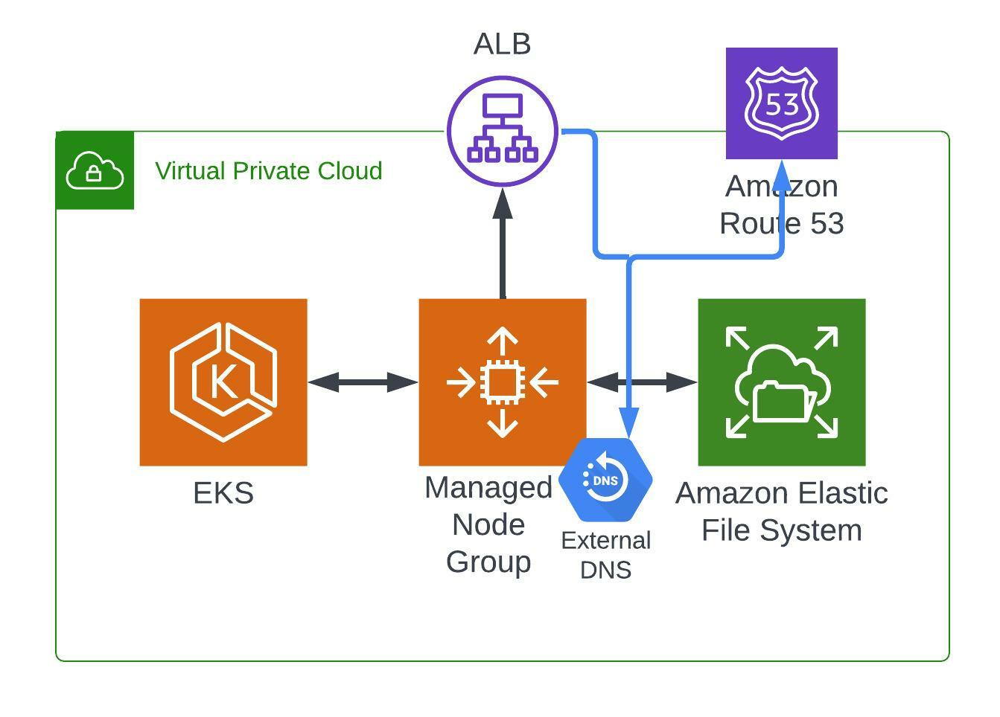

# Preface

This is a very simple, opinionated module to give you an eks cluster and associated efs store so your pvcs can cross AZ's. Note that efs is considerably slow, so if you're running a website or something of the sort, you're going to want either nginx micro caching or varnish in front of it. However you want to limit page rendering. EBS works natively out of the box, so you don't have to use EFS if you don't want to. 

Its a very simple and powerful architecture.

I don't expose instance size and a handful of other things at this time. This will accompany a blog post, of which the goal is to provide one of the cheapest, cost stable, k8s implementations out there. EFS is cheap, you get 12 spot instances totaling 24 cores and 24 gigs of ram for 60/mo. For just managed eks and nodes that's about 132/mo. You'll see a little creep on this with alb and efs costs, but it should be negligible. I'd say I highly doubt this ecosystem will exceed 200/mo. Some of the fully abstracted k8's services are cheap at a first glance, but they scale rapidly with compute needs. This maintains a mostly fixed cost (I think everyone nails you on network costs, it's like pennies though for fairly massive amounts of data).

I use the default public subnets, otherwise you need nat instances for private outbound and that costs money. 

# K8 Components

Out of the box, it will configure and install the EFS csi driver and generate the associated iam policy and service accounts against the OIDC endpoint. 

It will also configure external DNS, again with associated iam policies and service accounts. 

You also get nginx as a service which creates an associated load balancer. External dns will key on ingress objects you create and create alias records to your load balancer. 

<!-- BEGIN_TF_DOCS -->
## Inputs

| Name | Description | Type | Default | Required |
|------|-------------|------|---------|:--------:|
|  [name](#input\_name) | n/a | `string` | `"k8s"` | no |
|  [namespace](#input\_namespace) | n/a | `string` | `"playground"` | no |
|  [region](#input\_region) | n/a | `string` | n/a | yes |
|  [stage](#input\_stage) | n/a | `string` | `"dev"` | no |
|  [subnet\_ids](#input\_subnet\_ids) | n/a | `list(string)` | n/a | yes |
|  [vpc\_id](#input\_vpc\_id) | n/a | `string` | n/a | yes |
<!-- END_TF_DOCS -->